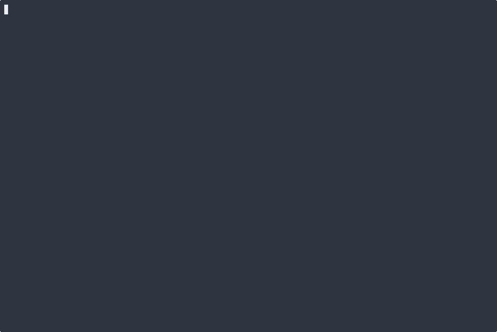
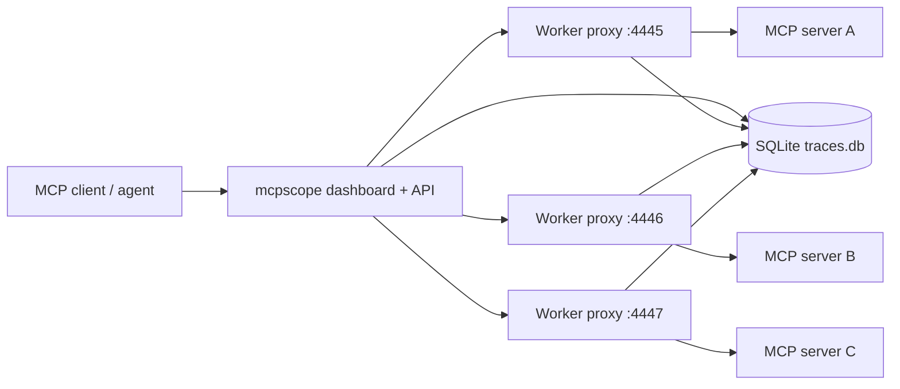

# mcpscope



Open source MCP observability: proxy traffic, inspect traces, replay calls, diff schemas, and alert on failures.

## What it does

- Proxies stdio and HTTP MCP traffic
- Captures request/response traces with latency and error state
- Serves a local dashboard for traces, latency, errors, and alerts, including trace search, time-range filtering, and alert rule editing
- Stores traces in SQLite with retention controls
- Supports workspace and environment scoping
- Accepts SDK-reported traces through `POST /api/ingest`
- Ships thin SDKs for direct embedding in Go and TypeScript servers
- Evaluates built-in alert rules and delivers to webhook, Slack, or PagerDuty
- Exports traces for replay and CI checks
- Snapshots and diffs MCP schemas

## Architecture



## Quick start

```bash
# Download the archive for your platform from:
# https://github.com/td-02/mcp-observer/releases/latest
```

```bash
mcpscope proxy --server ./your-mcp-server --db traces.db
```

Open `http://localhost:4444`.

For commands with arguments:

```bash
mcpscope proxy -- uv run server.py
```

For an existing HTTP MCP server:

```bash
mcpscope proxy --transport http --upstream-url http://127.0.0.1:8080
```

For source builds, `make build` and `make test` regenerate the dashboard assets before compiling the Go binary.

The dashboard trace view supports text search plus `created_after` and `created_before` filtering, and the Alerts tab lets you edit, enable, disable, or delete rules in place.

SDKs for direct embedding:

- Go: `github.com/td-02/mcp-observer/sdk/go/mcpscope`
- TypeScript: `@mcpscope/sdk`

See [`examples/sdk-go`](examples/sdk-go/) and [`examples/sdk-typescript`](examples/sdk-typescript/) for minimal usage.

## Common flows

Run with config:

```bash
mcpscope proxy --config ./mcpscope.example.json -- uv run server.py
```

Export traces:

```bash
mcpscope export --config ./mcpscope.example.json --output traces.json --limit 200
```

Replay traces:

```bash
mcpscope replay --input traces.json -- uv run server.py
```

Fail CI on replay errors or latency regressions:

```bash
mcpscope replay --input traces.json --fail-on-error --max-latency-ms 500 -- uv run server.py
```

Check schema compatibility:

```bash
mcpscope snapshot --server ./your-mcp-server --output baseline.json
mcpscope diff baseline.json current.json --exit-code
```

## Config

Example config: [`mcpscope.example.json`](mcpscope.example.json)

Key fields:

- `version`: current config schema version, `1`
- `workspace`: logical project boundary
- `environment`: logical environment like `prod` or `staging`
- `authToken`: bearer token for dashboard API access
- `notification.webhookUrls`: generic webhooks
- `notification.slackWebhookUrls`: Slack incoming webhooks
- `notification.pagerDutyRoutingKeys`: PagerDuty routing keys
- `proxy.db`: SQLite path
- `proxy.transport`: `stdio` or `http`
- `proxy.retainFor`: trace retention duration
- `proxy.maxTraces`: trace cap

CLI flags override config values.

## Verified

Verified in this repo with:

- `go test ./cmd ./internal/...`
- `npm exec tsc -b` in [`dashboard/`](dashboard/)
- fresh `mcpscope.exe` build
- regenerated demo GIF from the current binary and dashboard

## Notes

- The dashboard served by the Go binary comes from [`dashboard/dist`](dashboard/dist), which is checked in and embedded at build time.
- Rebuilding the Vite dashboard bundle currently needs Node `20.19+` or `22.12+`.
- The HTTP server exposes `/healthz` for liveness and `/readyz` for readiness.
- CI includes a smoke workflow that builds the packaged binary, starts a mock upstream, and exercises the dashboard and trace APIs end to end.

## Contributing

### Regenerating the demo

The demo GIF is fully automated. After making changes to the CLI output or adding features:

```bash
make demo
```

This requires `vhs` and `ffmpeg`. See `demo/README.md` for details.

## License

MIT
