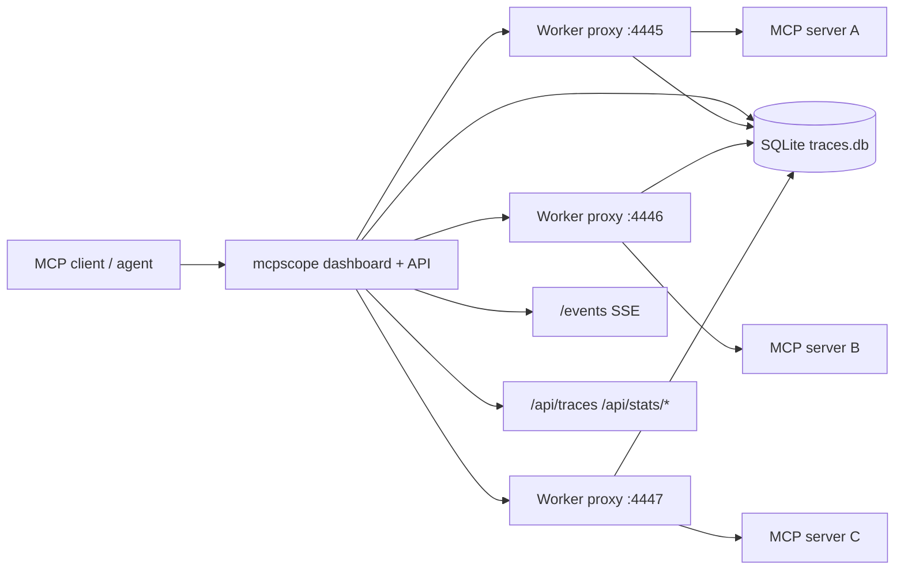

# Architecture

`mcpscope` sits between an MCP client and one or more MCP servers. It forwards traffic unchanged, but intercepts every request and response so it can log metadata, persist traces, emit OpenTelemetry spans, and stream updates to the dashboard.

## Intercept pipeline

1. A client sends JSON-RPC traffic to `mcpscope` over stdio or HTTP.
2. `mcpscope` forwards the raw message to the selected MCP worker proxy.
3. The proxy parses the JSON envelope, extracts method and payload details, and computes hashes, latency, and error metadata.
4. The event is:
   - written to stderr as structured JSON
   - persisted to SQLite
   - optionally exported as an OTEL span
   - published to the dashboard SSE stream

## Storage layer

The storage layer is abstracted behind the `TraceStore` interface so the persistence backend can be swapped later. The current implementation uses `modernc.org/sqlite` with embedded `golang-migrate` migrations.

Stored trace records include:

- server name and method
- server ID for multi-server fan-out routing
- params and response payloads
- hashes for params and responses
- latency and error state
- creation timestamp

## Dashboard SSE flow

The built-in HTTP server serves three roles:

- static dashboard assets
- JSON APIs for traces and aggregated statistics
- a live SSE feed for newly intercepted calls

